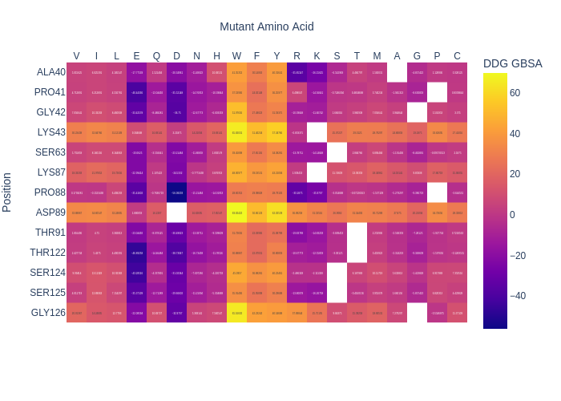

### Energy Evaluation of Single Mutant Homology Models:
<Br>

<p align="center">

</p>

### Installation and Dependencies:
1. Clone repo:
```sh
   git clone https://github.com/eved1018/EESMHM.git
```
2. Download Modeller: https://salilab.org/modeller/download_installation.html
    * for Conda enviroment:
```sh 
        conda config --add channels salilab
        conda install modeller
```
3. Download python dependencies:
```sh
    pip install -r requirements.txt 
```
4. Install and compile EvoEf1
```sh
    cd src/
    git clone https://github.com/tommyhuangthu/EvoEF.git
    cd EvoEF
    g++ -O3 -ffast-math -o EvoEF src/*.cpp
```

5. Download foldx (https://foldxsuite.crg.eu/) and move the executable and rotobase.txt to src/foldx folder.

### Configuration File:
The config.txt is used to guide the mutagensis and is organzied in three space seperated columns:
1) `1 letter amino acid` 
2) `residue number`
3) `comma seprated list of amino acids to mutate to or * for all`

If config.txt is empty all interface residues will be mutated.   

### Command line Arguments:
* `-pdb`: RCSB PDB id, if not provided you will be prompted to select one. If it is is in the curent working directory it will be used. Otherwise it will be downloaded from the RCSB.
* `-qc`: Query chain to mutate.
* `-ic`: Partner chain.


<p align="center">

</p>

